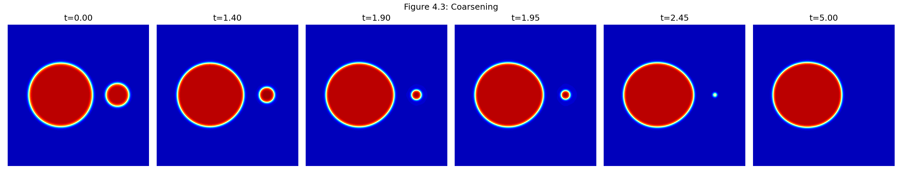
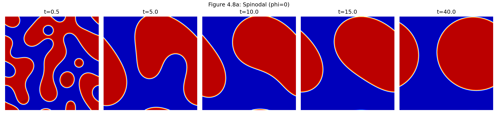
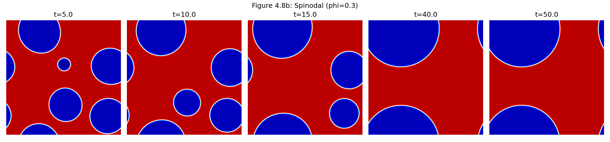

# Cahn-Hilliard-Darcy-SAV


Python implementation of the fully decoupled Scalar Auxiliary Variable (SAV) scheme proposed by Yang (2021) for the Cahn–Hilliard–Darcy system of two-phase Hele–Shaw flow.

This repository contains the computational framework developed for the Master's thesis:

**"On a Novel Fully Decoupled, Linear and Second-Order Accurate Numerical Scheme for the Cahn–Hilliard–Darcy System of Two-Phase Hele–Shaw Flow"**

University of Koblenz, 2026.

---

## Overview

The Cahn–Hilliard–Darcy system is a diffuse-interface model describing the evolution of two immiscible fluids in porous media and Hele–Shaw configurations.

This repository provides CPU and GPU implementations of a fully decoupled, linear, and second-order accurate Scalar Auxiliary Variable (SAV) scheme for solving the Cahn–Hilliard–Darcy system numerically.

The implementation includes:

- A CPU-based solver using scientific Python libraries.
- A GPU-accelerated solver using CUDA-compatible hardware.
- Fourier spectral discretization.
- Numerical simulations of phase separation dynamics.
- Validation experiments and convergence studies.
- Performance comparison between CPU and GPU implementations.

---

# Mathematical Model

The Cahn–Hilliard–Darcy system couples phase-field evolution with fluid motion through the interaction between:

- the Cahn–Hilliard equation describing phase separation,
- Darcy's law describing fluid velocity,
- incompressibility constraints.

The phase-field variable represents the distribution of the two fluid phases, while the velocity field describes the associated flow dynamics.

The numerical framework implemented in this repository follows the fully decoupled Scalar Auxiliary Variable (SAV) approach introduced by Yang (2021).

---

# Numerical Method

The implemented scheme is based on a fully decoupled, linear, and second-order accurate SAV formulation.

The main characteristics of the method are:

- fully decoupled time-stepping procedure,
- linear systems at each time step,
- second-order temporal accuracy,
- energy stability,
- efficient spectral discretization.

Spatial derivatives are computed using Fourier spectral methods together with Fast Fourier Transform (FFT) techniques.

The method is designed to provide accurate and efficient simulations of two-phase flow and phase separation dynamics.

---

# Repository Structure

```
Cahn-Hilliard-Darcy-SAV/
│
├── README.md
├── LICENSE
├── CITATION.cff
├── requirements.txt
├── environment.yml
│
├── CPU/
│   └── CHD_CPU.ipynb
│
├── GPU/
│   └── CHD_GPU.ipynb
│
├── examples/
│
├── figures/
│
├── benchmarks/
│
└── docs/
    └── Master_Thesis.pdf
```

---

# Requirements

## CPU Version

The CPU implementation requires:

- Python ≥ 3.10
- NumPy
- SciPy
- Matplotlib
- Jupyter Notebook

## GPU Version

The GPU implementation additionally requires:

- NVIDIA GPU
- CUDA toolkit
- CuPy

---

# Installation

Clone the repository:

```bash
git clone https://github.com/FarinFar89/Cahn-Hilliard-Darcy-SAV.git

cd Cahn-Hilliard-Darcy-SAV
```

Install the required dependencies:

```bash
pip install -r requirements.txt
```

For GPU execution, ensure that the CUDA environment and CuPy installation are correctly configured.

---

# Running the Simulations

The CPU and GPU implementations are provided as Jupyter notebooks.

## CPU Implementation

Run:

```
CPU/CHD_CPU.ipynb
```

## GPU Implementation

Run:

```
GPU/CHD_GPU.ipynb
```

Start Jupyter Notebook:

```bash
jupyter notebook
```

and execute the notebooks sequentially.

---

# CPU Implementation

The CPU version provides a reference implementation of the numerical scheme using standard scientific computing libraries.

It is intended for:

- verification of the numerical method,
- reproducibility,
- moderate-size simulations,
- comparison with accelerated implementations.

---

# GPU Implementation

The GPU version provides an accelerated implementation using CUDA-compatible GPU computing.

The GPU implementation enables:

- faster time integration,
- larger computational domains,
- higher-resolution simulations,
- efficient parameter studies.

---

# Numerical Experiments

The repository contains numerical experiments demonstrating the performance and accuracy of the implemented scheme.

## Droplet Coarsening

Simulation of phase separation and droplet evolution over time.

## Spinodal Decomposition

Simulation of spontaneous phase separation from an initially mixed state.

## Convergence Study

Verification of the temporal accuracy and numerical properties of the scheme.

## Numerical Results

The implementation reproduces the numerical experiments presented in the accompanying Master's thesis.

### Droplet Coarsening

The following simulation illustrates droplet coarsening, where a smaller droplet gradually dissolves while the larger droplet grows due to mass diffusion.

<p align="center">
  
</p>

---

### Spinodal Decomposition (φ = 0)

Evolution from a random initial condition with zero average concentration.

<p align="center">
  
</p>

---

### Spinodal Decomposition (φ = 0.3)

Evolution from an initial condition with non-zero average concentration.

<p align="center">
  
</p>

---

### Temporal Convergence

Comparison of the numerical error for different SAV-based schemes.

<p align="center">
  
</p>
---

# Performance Benchmark

The repository includes a comparison between CPU and GPU implementations.

The benchmark evaluates the computational acceleration achieved through GPU computing.

Benchmark results will be provided in:

```
benchmarks/CPU_vs_GPU.md
```

---
---

# Project Highlights

- Implementation of the fully decoupled Scalar Auxiliary Variable (SAV) scheme proposed by Yang (2021) for the Cahn–Hilliard–Darcy system.
- Linear, second-order accurate, and energy-stable time integration.
- Fourier spectral spatial discretization using Fast Fourier Transforms (FFT).
- CPU implementation based on NumPy and SciPy.
- GPU-accelerated implementation using CuPy and CUDA.
- Reproduction of the numerical experiments presented in the accompanying Master's thesis.
- Validation through droplet coarsening, spinodal decomposition, and temporal convergence studies.
- Open-source Python implementation intended for scientific computing, numerical analysis, and computational mathematics research.

---

# Reproducing the Thesis Results

The numerical experiments presented in the accompanying Master's thesis can be reproduced using the provided CPU and GPU implementations.

## Droplet Coarsening

Run either

```text
CPU/CHD_CPU.ipynb
```

or

```text
GPU/CHD_GPU.ipynb
```

and execute the section corresponding to the droplet coarsening experiment.

The generated simulation reproduces the droplet coarsening dynamics presented in the thesis.

---

## Spinodal Decomposition

The spinodal decomposition experiments are included in both notebooks.

Run the corresponding simulation sections to reproduce the numerical results for

- Zero average concentration (φ = 0)
- Non-zero average concentration (φ = 0.3)

The generated figures correspond to those presented in the accompanying Master's thesis.

---

## Temporal Convergence Study

The temporal convergence study can be reproduced by executing the refinement experiments included in the notebooks.

The implementation verifies the second-order temporal accuracy of the fully decoupled SAV scheme by comparing numerical solutions obtained with progressively refined time-step sizes.

---

## CPU vs GPU Benchmark

A comparison of the computational performance of the CPU and GPU implementations is provided in

```text
benchmarks/CPU_vs_GPU.md
```

The benchmark summarizes the hardware configuration, execution times, and observed performance improvements for representative numerical experiments performed during this project.

---

## Figures

The repository contains the figures used throughout the accompanying Master's thesis in the `figures/` directory, including

- Droplet coarsening
- Spinodal decomposition (φ = 0)
- Spinodal decomposition (φ = 0.3)
- Temporal convergence study

These figures can be regenerated directly from the provided notebooks.

---

## Thesis

The complete mathematical formulation, derivation of the numerical scheme, implementation details, validation, and discussion of the numerical experiments are available in

```text
docs/Master_Thesis.pdf
```

Readers interested in the theoretical background and numerical analysis are encouraged to consult the thesis alongside the implementation.

---

## Acknowledgements

This repository accompanies the Master's thesis

**"On a Novel Fully Decoupled, Linear and Second-Order Accurate Numerical Scheme for the Cahn–Hilliard–Darcy System of Two-Phase Hele–Shaw Flow"**

submitted to the **University of Koblenz (2026)**.

The implementation is based on the fully decoupled Scalar Auxiliary Variable (SAV) framework proposed by **Yang (2021)** and extends it with both CPU and GPU implementations for efficient numerical simulation of the Cahn–Hilliard–Darcy system.

# References

Yang, X. (2021).

A fully decoupled, linear, and second-order accurate numerical scheme for the Cahn–Hilliard–Darcy system.

---

# Citation

If you use this repository in your research, please cite:

```
F. Farrokhseresht,
"Cahn-Hilliard-Darcy-SAV:
Python implementation of a fully decoupled SAV scheme for the Cahn–Hilliard–Darcy system",
University of Koblenz, 2026.
```

See `CITATION.cff` for citation information.

---

# License

This project is released under the MIT License.

See `LICENSE` for details.
